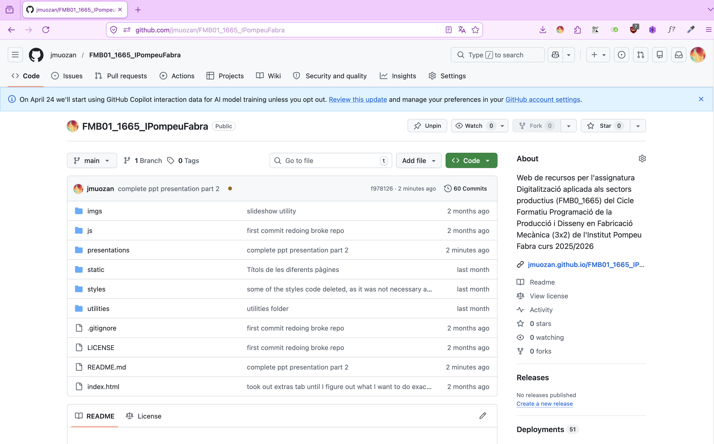
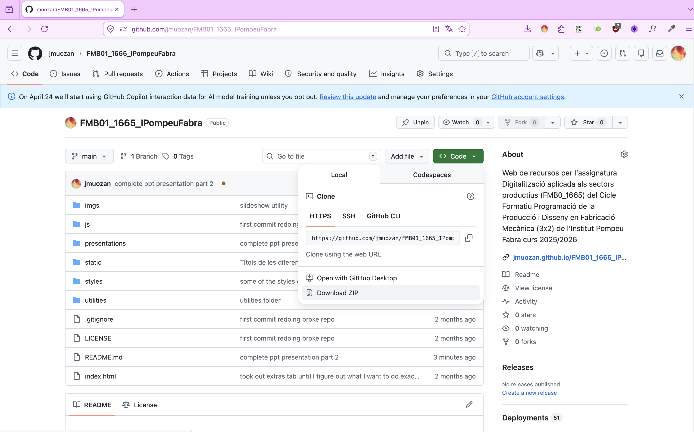
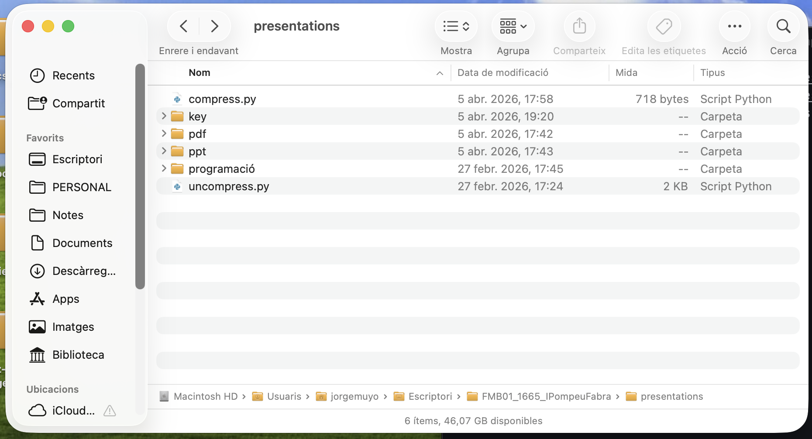
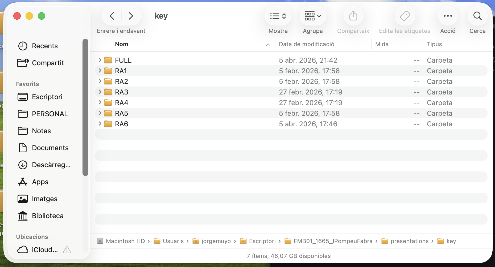
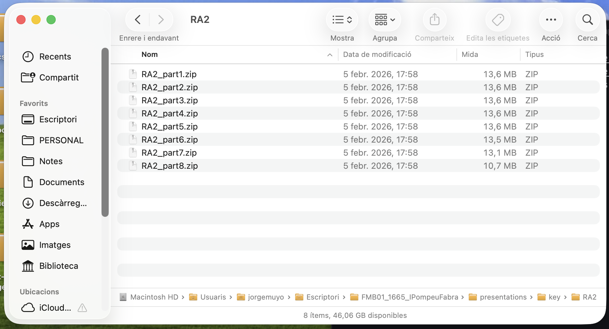
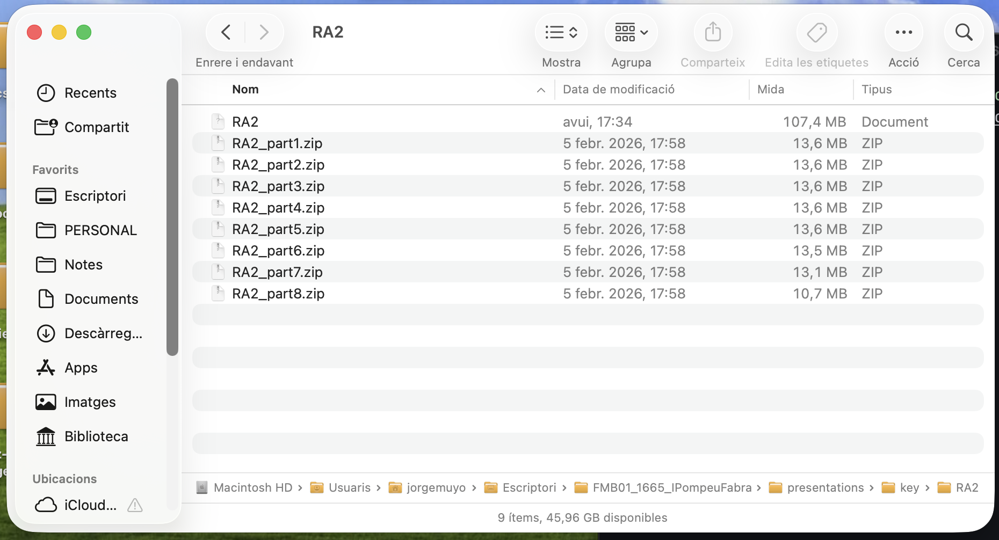
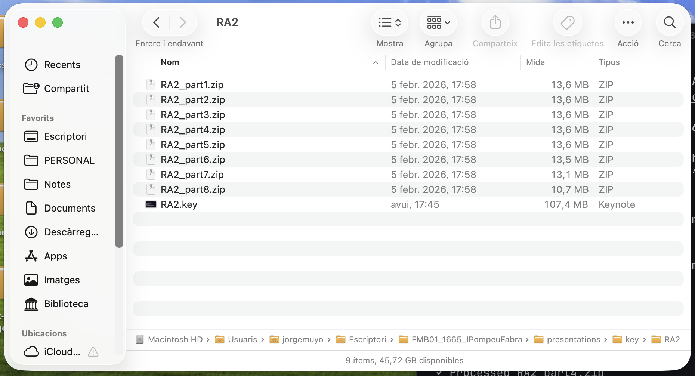
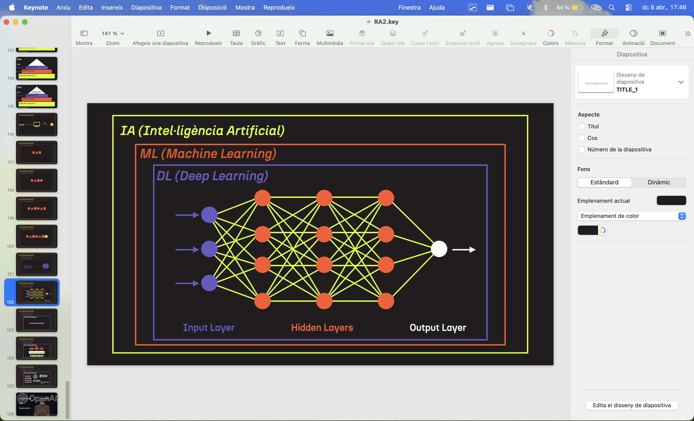

# Digitalització Aplicada al Sector Productiu

Web de recursos per l'assignatura Digitalització aplicada als sectors productius (FMB0_1665) del Cicle Formatiu Programació de la Producció i Disseny en Fabricació Mecànica (3x2) de l'[Institut Pompeu Fabra](https://agora.xtec.cat/iespompeufabra-bdn/) curs 2025/2026

Esta web està sota una [llicència MIT](./LICENSE). Per qualsevol dubte t'invite a contactar amb mi o bé per [correu](jmuozan@gmail.com) o bé per [LinkedIn](www.linkedin.com/in/jorgemunozzanon)


Tots els arxius de presentació són disponibles en aquest repositori en diversos formats: ```.pdf``` (tant compresses com sense comprimir), ```.key``` i ```.pptx``` a la carpeta ```presentations```. Per accedir tant a les presentacions per RA com a la completa en qualsevol dels formats (excepte el ```.pdf``` comprés), cal tindre instal·lat python. A continuació cal seguir les següents passes:

## 1. Clonar el repositori

Obrir el terminal de l'ordinador i una vegada situat a la carpeta que desitges teclejar el següent (important tindre [git](git-scm.com) instal·lat)

```
git clone https://github.com/jmuozan/FMB01_1665_IPompeuFabra.git
```

també és possible dirigir-se al [següent web](https://github.com/jmuozan/FMB01_1665_IPompeuFabra) i dins del desplegable ```Code``` fer click al botó ```Download ZIP```






## 2. Obrir la carpeta amb les presentacions

A la terminal fer:

```
cd FMB01_1665_IPompeuFabra/presentations
```

3. Estrucutra del repositori

L'estructura del repositori és la següent:

```
FMB01_1665_IPompeuFabra/
├── presentations/
│   ├── compress.py
│   ├── uncompress.py
│   ├── programació/
│   ├── pdf/
│   │   ├── compressed/
│   │   ├── FULL/
│   │   ├── RA1/
│   │   ├── RA2/
│   │   └── ...
│   ├── key/
│   │   ├── FULL/
│   │   ├── RA1/
│   │   ├── RA2/
│   │   └── ...
│   └── ppt/
│       ├── FULL/
│       ├── RA1/
│       ├── RA2/
│       └── ...
├── imgs/
├── js/
├── static/
├── styles/
├── utilities/
├── index.html
└── README.md
```

cada nom de subcarpeta a la carpeta ```presentations``` representa el tipus d'arxius dins ```pdf``` ```key``` (per keynote) i ```ppt``` (per arcius powerpoint). ```compress.py``` i ```uncompress.py``` són les utilitats que es faran servir per la descompressió. 

Dins de cada subcarpeta hi ha una nova jerarquia de carpetes, ```FULL``` per la presentació completa del mòdul o ```RA1```, ```RA2```, ```RA3```, ```RA4```, ```RA5``` i ```RA6``` per les presentacions (en el format que pertoque) de cada Resultat d'Aprenentatge. La carpeta ```pdf``` té un altra subcarpeta anomenada ```compressed```, aquesta té les presentacions de tot el mòdul i de cada RA com a pdf de baixa qualitat. Per fer ús d'aquestes, només cal obrir-les i prou, no hi ha cap altre procés.

En cas de voler accedir a pdfs de major qualitat o a altre tipus d'arxius editables, com els ja mencionats anteriorment, cal fer un pas posterior. 

4. Set up python

Si obriu qualsevol de les carpetes que no siga ```compressed```, vos adonareu de que aquestes contenen un munt d'arxius ```.zip``` (compressos) dividits en parts. La totalitat d'aquests representa cada presentació. Per accedir-hi, no les intenteu descomprimir amb els programes tradicionals, ja que, probablement no funcionarà. 

La descompressió és realitzarà amb l'arxiu ```uncompress.py```, un arxiu de python. Per fer-lo servir vos caldrà instal·lar python. Si teniu un mac, es farà de la següent manera:

### Instal·leu homebrew
```
/bin/bash -c "$(curl -fsSL https://raw.githubusercontent.com/Homebrew/install/HEAD/install.sh)"
```
```
brew update
```

### Instal·leu python && pip

```
brew install python
```

```
pip3 --version && python3 --version
```

### Instal·leu zipfile

```
pip install zip-files
```

## 5. Descompressió arxius

En el terminal, dins la carpeta ```presentations``` executeu el següent comandament:

```
python3 uncompress.py
```

Feu enter i rebreu el següent missatge al terminal:

```
Enter the folder path containing the zip parts:
```

Ací, haureu de teclejar la ruta de la carpeta on és la presentació a la qual voleu accedir. Posem-ne un exemple, si volguera descomprimir la presentació de l'RA2 en format keynote, posaria la ruta ```./key/RA2/```. La qual representa entrar a la carpeta ```key``` i subcarpeta ```RA2```, rebent el següent a la terminal:

```
➜  presentations git:(main) ✗ python3 uncompress.py
Enter the folder path containing the zip parts: ./key/RA2/

Reassembling 'RA2' from 8 parts...
  ✓ Processed RA2_part1.zip
  ✓ Processed RA2_part2.zip
  ✓ Processed RA2_part3.zip
  ✓ Processed RA2_part4.zip
  ✓ Processed RA2_part5.zip
  ✓ Processed RA2_part6.zip
  ✓ Processed RA2_part7.zip
  ✓ Processed RA2_part8.zip
Output file: ./key/RA2/RA2
Size: 102.44 MB
```





Una vegada fet veureu un arxiu generat, però sense extensió:



Per solventar-ho, caldra, en aquest cas, executar el següent comandament:

```
mv ./key/RA2/RA2 ./key/RA2/RA2.key
```




Tingueu en compte, però, que caldra canviar les rutes ```./key/RA2/RA2``` i ```./key/RA2/RA2.key``` depenent de quin arxiu esteu descomprimint, per possar-ne un altre exemple, si volguera fer el mateix per la presentació de tot el mòdul complet en format power point, utilitzaria aquest comandament:

```
mv ./ppt/FULL/1665_FMB01 ././ppt/FULL/1665_FMB01.pptx
```